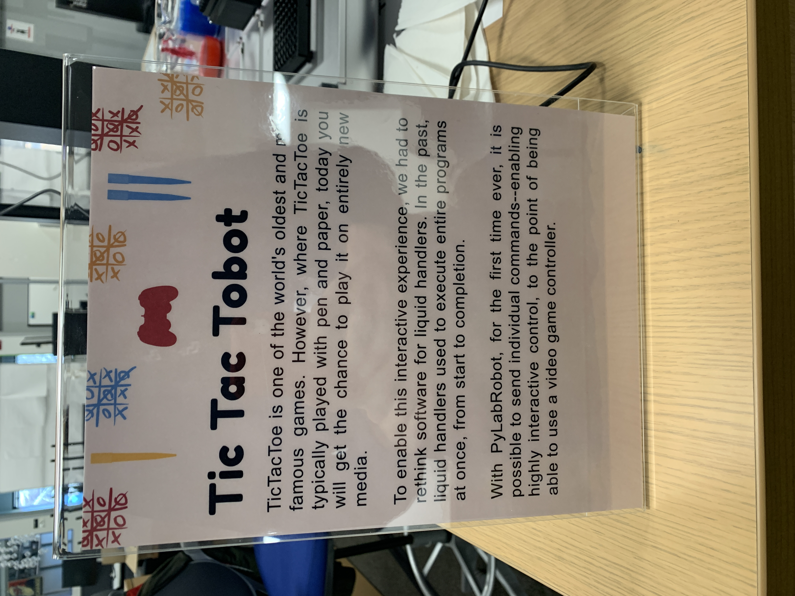
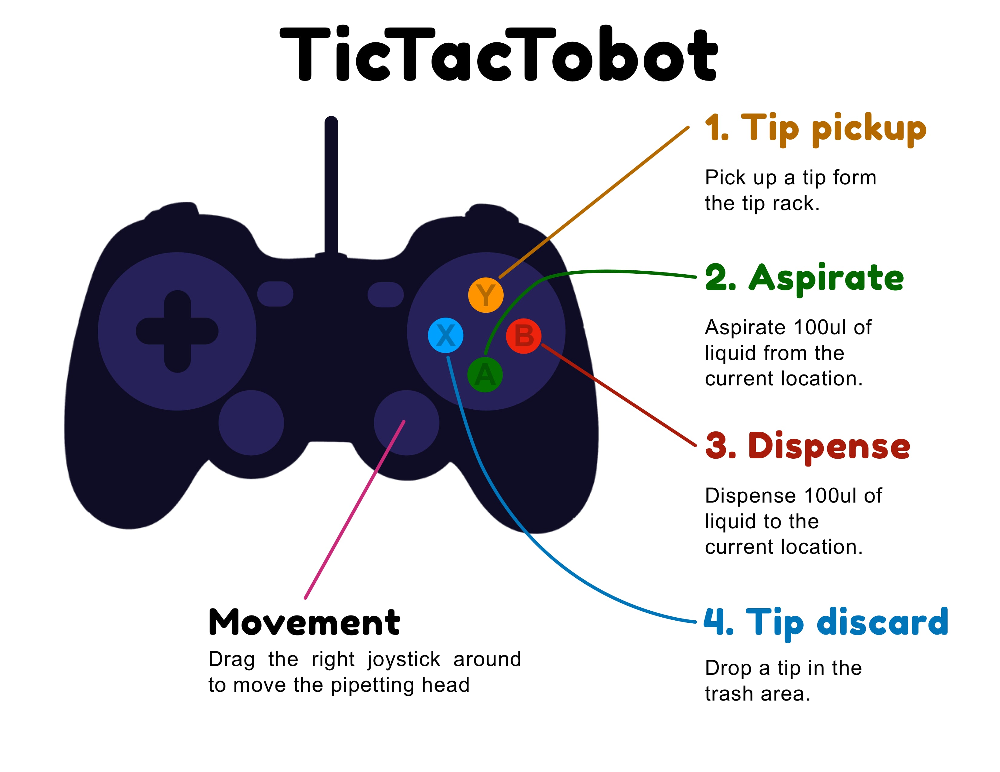

# TicTacTobot

TicTacToe on an Opentrons Liquid Handling Robot, using a video game controller.

See the [video]().




## Developers

- Install from a custom branch of the Opentrons API, to make everything run smoothly. Available [here](https://github.com/rickwierenga/opentrons/tree/tictactobot).
- Install [python-gamepad](https://github.com/rickwierenga/python-gamepad)

```
python ttt.py # run on the Opentrons
```

- Note: this code is written in "Hackathon style", it's not pretty (at all), but it works.

---

_This project was developed for the Sculpting Evolution Group, to present at the Media Lab's Members Meeting, Fall 2022_
